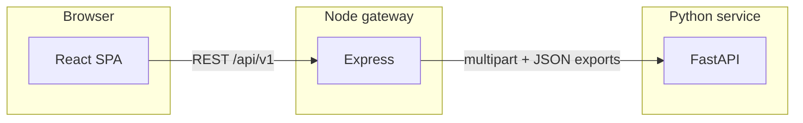

# Audit platform

Monorepo for **spreadsheet-led audits**: teams upload Excel workbooks, the stack validates rows against domain rules, and returns structured JSON plus optional **invalid-row Excel exports**. The product UI is organized around **Scrutiny** (automated checks on ledgers) and **Vouching** (voucher-oriented workflows; partly placeholder).

---

## Services

End-to-end flow: **browser → Node API → Python validation service**.



| Service | Responsibility |
| --- | --- |
| **frontend** | React SPA (Scrutiny routes: PAN, gross weight, sales ledger). Uploads files and renders summaries, tables, CSV/export affordances. Talks to the Node gateway (`/api/v1/...`). |
| **backend** | Express gateway: versioning, uploads, body limits, CORS, optional Swagger. Proxies each scrutiny processor to Python (validate + export-invalid where implemented). Long-running Excel jobs use extended timeouts on selected routes (e.g. sales audit). |
| **python-service** | FastAPI microservice: reads `.xlsx` / `.xlsm` (and `.xls` where a processor supports it), streams rows with **openpyxl read-only** where applicable, runs processors, returns unified success payloads (`summary`, `records`, optional `performance` / `rowStats`). |

Setup, ports, env vars, and curl examples live in each folder’s README: [backend/README.md](backend/README.md), [python-service/README.md](python-service/README.md), [frontend/README.md](frontend/README.md).

---

## Repository structure

```text
audit_platform/
├── frontend/                 # React + Vite UI
├── backend/                  # Express API gateway
├── python-service/           # FastAPI processors & validators
└── README.md                 # This file — orientation only
```

| Area | Notable paths |
| --- | --- |
| UI pages & scrutiny flows | `frontend/src/pages/`, `frontend/src/components/` |
| Gateway routes & Python client | `backend/src/routes/`, `backend/src/services/pythonClient.service.js` |
| Processors & rules | `python-service/app/processors/`, `python-service/app/validators/` |
| Shared Excel utilities | `python-service/app/utils/` (headers, readers, exporters) |

Processors are registered in `python-service/app/processors/factory.py` and exposed under `python-service/app/routers/process_router.py`; the gateway mirrors the paths its README lists under `/api/v1/process/...`.

---

## Business logic (by processor)

Rules below are **conceptual**. Exact columns, issue strings, and response shapes are documented in [python-service/README.md](python-service/README.md) and OpenAPI where enabled.

### PAN audit

- Validates PAN-related columns and row-level compliance tied to **transaction value** (e.g. PAN presence and format above ₹2L thresholds, address-proof expectations above ₹50k where configured).
- Output is row-level **issues** plus aggregates in **summary**; invalid rows can be exported to Excel via the gateway.

### Gross weight audit

- Validates **manual vs automatic gross weight** and **difference** (tabular or voucher-style layouts depending on the workbook).
- Enforces consistency rules (e.g. equality after decimal normalization, difference expectations per validator implementation).

### Sales ledger audit

- Inputs require normalized notions of **`sales_account`** and **`product`** (Excel headers normalized to snake_case).
- **Expected category** is inferred from the sales account text (e.g. **14k / 18k / 22k / 24k / jadau**).
- **Predicted category** is inferred from the product text using keyword rules, then **rapidfuzz** fuzzy fallback when direct keywords do not match (production paths optimize large sheets: classify only when the sales account implies a category; streaming reads; caching).
- A row is **valid** when expected and predicted categories **match** (rows without a recognizable sales-account category are kept as valid neutrals for totals). Mismatch or unclassified product under an expected category yields **invalid** with a single business issue message.
- Responses include **summary** counts (valid/invalid, fuzzy usage, unknown products, category buckets including unknown ledger rows) and optional invalid-row **export**.

---

For deployment and developer workflows, follow the per-service READMEs linked above.
