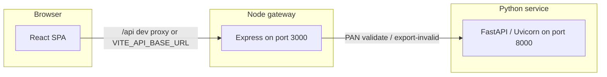

# Audit platform

Monorepo for an **audit and compliance** web application focused on **spreadsheet validation**. Teams upload Excel workbooks; the stack normalizes headers, runs domain rules (PAN, GST, gross weight, sales), and returns structured results plus optional exports of invalid rows.

The product is organized around **Scrutiny** (automated checks on ledgers and supporting data) and **Vouching** (workflow placeholders for voucher matching and review). The **PAN** path is fully wired end-to-end; other processors exist in the Python service with scaffolding you can extend.

## Architecture



| Layer | Role |
| --- | --- |
| **frontend** | React 19 + Vite 8 + Tailwind CSS 4. SPA with dashboard, scrutiny modules, and PAN upload/results. Calls the Node API (`/api/v1/...`). |
| **backend** | Express gateway: versioning, CORS, uploads, JSON limits, Swagger UI. Proxies **PAN** validate and invalid-row export to the Python service. |
| **python-service** | FastAPI: reads `.xlsx` / `.xlsm` / `.xls`, normalizes headers to `snake_case`, runs processors (PAN rules are complete; GST / gross weight / sales are lighter scaffolding). |

## Repository layout

```text
audit_platform/
  frontend/          # React + Vite UI (port 5173 by default)
  backend/           # Express API (port 3000)
  python-service/    # FastAPI + pandas/openpyxl (port 8000)
```

Each service has its own `README.md` with endpoint tables, env vars, and curl examples:

- [backend/README.md](backend/README.md) — Node routes, Swagger, `curl` samples
- [python-service/README.md](python-service/README.md) — validation rules, required columns, response shapes, `pytest`

## Prerequisites

- **Node.js** 18 or newer (backend and frontend)
- **Python** 3.10 or newer (`python-service`)
- `npm` and `pip`

## Quick start (local development)

Run the three processes in separate terminals, **in this order**: Python first, then Node, then the SPA.

### 1. Python service (FastAPI)

```bash
cd python-service
python -m venv .venv
# Windows PowerShell: .\.venv\Scripts\Activate.ps1
# Git Bash / macOS / Linux:
source .venv/bin/activate
pip install -r requirements.txt
uvicorn app.main:app --reload --port 8000
```

- Health: `http://127.0.0.1:8000/api/health`
- Interactive docs: `http://127.0.0.1:8000/docs`

### 2. Node gateway (Express)

```bash
cd backend
cp .env.example .env
npm install
npm run dev
```

- Health: `http://127.0.0.1:3000/api/health`
- Swagger UI (when `ENABLE_SWAGGER=true`): `http://127.0.0.1:3000/api-docs`

### 3. Frontend (Vite)

```bash
cd frontend
cp .env.example .env
npm install
npm run dev
```

Open `http://127.0.0.1:5173`. In development, Vite proxies **`/api`** to `http://127.0.0.1:3000`, so you can leave `VITE_API_BASE_URL` empty in `.env` and still hit the gateway through same-origin paths.

**Production builds:** set `VITE_API_BASE_URL` to the public URL of the Node API (see [frontend/.env.example](frontend/.env.example)).

## Environment variables (summary)

| Service | File | Highlights |
| --- | --- | --- |
| Backend | `backend/.env` from [.env.example](backend/.env.example) | `PORT`, `PYTHON_SERVICE_URL` (default `http://127.0.0.1:8000`), `CORS_ORIGIN`, upload/body limits, `ENABLE_SWAGGER` |
| Frontend | `frontend/.env` from [.env.example](frontend/.env.example) | `VITE_API_BASE_URL` — empty in dev for Vite proxy |
| Python | optional `.env` | `APP_PORT`, `CHUNK_SIZE`, `LOG_LEVEL`, etc. — see [python-service/README.md](python-service/README.md) |

## HTTP API surface

The UI targets the **Node** base path `/api/v1`:

| Method | Path | Description |
| --- | --- | --- |
| `GET` | `/api/health` | Gateway health |
| `POST` | `/api/v1/process/pan/validate` | `multipart/form-data`, field **`file`** — Excel PAN audit (proxied to Python) |
| `POST` | `/api/v1/process/pan/export-invalid` | JSON `{ "records": [...] }` — download `.xlsx` of invalid rows |

Python also exposes `/api/process/gross-weight` for direct calls alongside `/api/process/pan`; see the python-service README.

## Frontend application map

Built with **React Router 7**, **TanStack Table**, **Axios**, **Framer Motion**, **Lucide** icons, and **react-hot-toast**.

| Area | Routes (examples) |
| --- | --- |
| Dashboard | `/dashboard` |
| Scrutiny hub | `/scrutiny` — **PAN** `/scrutiny/pan`, **gross weight** `/scrutiny/gross-weight`, **sales ledger** `/scrutiny/sales-ledger`; GST and other tiles may show “coming soon” |
| Vouching hub | `/vouching` — placeholder flows under `/vouching/*` |
| Other | `/reports`, `/settings` |

Session-oriented KPIs on the dashboard (files processed, errors flagged) are driven from client context after validations in the active browser session.

## Scripts

| Location | Command | Purpose |
| --- | --- | --- |
| `frontend/` | `npm run dev` | Vite dev server |
| `frontend/` | `npm run build` | Production bundle |
| `frontend/` | `npm run lint` | ESLint |
| `backend/` | `npm run dev` | Express with `--watch` |
| `backend/` | `npm start` | Production mode |
| `python-service/` | `PYTHONPATH=. pytest` | Test suite |

## PAN validation (conceptual)

Rules are implemented in `python-service` (see [python-service/README.md](python-service/README.md) for exact issue codes and column contracts). In short: PAN format checks, missing PAN when `total_value` is above ₹2L, address proof when above ₹50k, and required columns including both `pan` and `pan1` headers on the sheet.

## Contributing and extending

- Add or change spreadsheet logic in `python-service/app/processors/` and register processors in `factory.py`.
- Add Node routes only when you need a stable gateway contract, auth, or upload limits in front of Python.
- Match existing UI patterns (layout, cards, tables) when adding new scrutiny pages.

---

This README is the **entry point** for the repo; service-specific behavior, OpenAPI, and validation matrices live in the per-folder documentation linked above.
