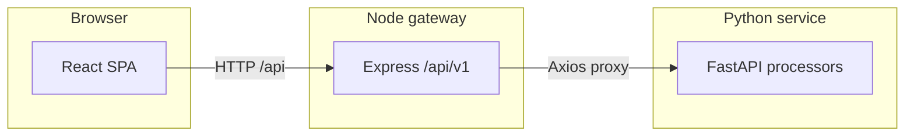

# Audit platform

Web application for **spreadsheet-driven audits**: teams upload Excel ledgers, the stack validates structure and business rules, and the UI surfaces row-level issues (with PAN-specific export of invalid rows). The product is organised around **Scrutiny** (active checks: PAN, gross weight, sales ledger; GST and other modules are scaffolded) and **Vouching** (placeholder flows), plus dashboard, reports, and settings.

## Business logic (high level)

1. **Upload** — User selects an `.xlsx` / `.xlsm` / `.xls` file in the browser or via API (`multipart/form-data`, field **`file`**).
2. **Gateway** — The Node API validates request limits, optional **`x-request-id`**, and forwards to the Python service.
3. **Processing** — Headers are normalised to **snake_case**; required columns are enforced per audit type; row-level rules run (**PAN**, **gross weight**, and **sales ledger** are implemented end-to-end in Python; **GST** and other modules are lighter / scaffolded).
4. **Outcome** — JSON responses include **`totalRows`**, **`errorRows`**, **`summary`**, and per-row **`records`** with **`issues`** where the processor emits them (gross weight currently reports mismatches in **`summary`** only — see below).
5. **PAN export** — Clients can POST the **`records`** payload back to generate an **invalid-rows `.xlsx`** download.

### PAN rules (implemented)

Aligned with [`python-service/README.md`](python-service/README.md):

- **Format:** `AAAAA9999A` on non-empty `pan` / `pan1` values.
- **`total_value` above ₹2L:** at least one valid PAN in `pan` or `pan1`; otherwise missing-PAN / invalid-format issue codes.
- **At or below ₹2L:** if either column holds a valid PAN, PAN checks pass; non-empty but invalid values → invalid-format.
- **`total_value` above ₹50k:** at least one of **`add_proof`**, **`add_proof_2`** must be present → else missing address-proof code.

### Gross weight rules (implemented)

- **Columns:** after normalisation, **`manual_gross_weight`** and **`auto_gross_weight`** are required (aliases **`manual_gross_wt`** / **`auto_gross_wt`** are accepted and mapped).
- **Header row:** the sheet may have preamble rows above the header; the service scans for a row that contains both manual and auto gross-weight headers.
- **Rule:** for each data row where both cells parse as numbers, if **|manual − auto| > `GROSS_WEIGHT_TOLERANCE`** (default **0.5**, from env / `app/config/settings.py`), that row counts as a mismatch.
- **Response:** **`summary.weightMismatch`** holds the count of mismatched rows; **`records`** is currently empty for this processor (aggregate-only).

### Sales ledger rules (implemented)

See [`python-service/app/processors/sales_audit_processor.py`](python-service/app/processors/sales_audit_processor.py).

- **Columns:** **`voucher_no`**, **`sales_account`**, **`product`**, **`manual_gross_wt`**, **`auto_gross_wt`** (with **`manual_gross_weight`** / **`auto_gross_weight`** accepted as aliases). Preamble rows above a single header row are supported (same header-detection idea as gross weight).
- **Sales account ↔ product:** when the sales-account text maps to an expected category, the **`product`** label is classified to a category; mismatches raise **`PRODUCT_CATEGORY_DOES_NOT_MATCH_SALES_ACCOUNT`**; unclassified product when a rule applies → **`MISSING_PRODUCT_CATEGORY_FOR_VALIDATION`**. Rows whose sales account has no mapping are skipped for that check (**`summary.skippedNoRule`**).
- **Dominant account per product:** if the file has a clearly dominant normalised **`sales_account`** for a given **`product`**, other rows with the same product but a different account get **`CONFLICTING_SALES_ACCOUNT_FOR_PRODUCT`**.
- **Weights:** if both manual and auto gross weights parse as numbers and **|manual − auto| > `GROSS_WEIGHT_TOLERANCE`**, the row gets **`GROSS_WEIGHT_OUTSIDE_TOLERANCE`**.

Sheet contracts and extra detail: [`python-service/README.md`](python-service/README.md).

## Architecture



- **`frontend/`** — React 19, Vite 8, Tailwind 4, React Router; calls **`/api/v1/...`** on the Node server (dev proxy to port **3000**).
- **`backend/`** — Express API: CORS, Helmet, Multer uploads, Swagger UI, routes under **`/api/v1/process/...`** → Python.
- **`python-service/`** — FastAPI: Excel ingest (Pandas / OpenPyXL), validators, processors, PAN invalid-row Excel export.

## Repository layout

```text
audit_platform/
  frontend/          # React UI (Scrutiny hub, PAN / gross weight / sales pages, etc.)
  backend/           # Express gateway + OpenAPI spec
  python-service/    # FastAPI Excel validation and auditing
```

Per-service setup, env vars, and curl examples: [`backend/README.md`](backend/README.md), [`python-service/README.md`](python-service/README.md).

## Tech stack

| Layer | Technologies |
| ----- | ------------ |
| UI | React 19, Vite, Tailwind CSS 4, React Router 7, TanStack Table, Axios, Framer Motion |
| API gateway | Node.js 18+, Express, Multer, Axios, Swagger UI, Helmet, CORS |
| Processing | Python 3.10+, FastAPI, Uvicorn, Pandas, OpenPyXL, Pydantic, Loguru, Pytest |

## Run locally (development)

1. **Python service** (port **8000** by default)

   ```bash
   cd python-service
   python -m venv .venv
   source .venv/bin/activate   # Windows: .venv\Scripts\activate
   pip install -r requirements.txt
   cp .env.example .env      # optional
   uvicorn app.main:app --reload --port 8000
   ```

2. **Node API** (port **3000**)

   ```bash
   cd backend
   cp .env.example .env       # set PYTHON_SERVICE_URL if Python is not on 127.0.0.1:8000
   npm install
   npm run dev
   ```

3. **Frontend** (port **5173**, proxies **`/api`** → Node)

   ```bash
   cd frontend
   cp .env.example .env       # empty VITE_API_BASE_URL uses the proxy
   npm install
   npm run dev
   ```

Open the app at **`http://127.0.0.1:5173`**. Swagger for the gateway: **`http://127.0.0.1:3000/api-docs`** (when `ENABLE_SWAGGER` is not `false`). Python docs: **`http://127.0.0.1:8000/docs`**.

## Gateway routes (summary)

| Flow | Method | Path |
| ---- | ------ | ---- |
| Health | `GET` | `/api/health` |
| PAN validate | `POST` | `/api/v1/process/pan/validate` |
| PAN export invalid rows | `POST` | `/api/v1/process/pan/export-invalid` |
| Gross weight validate | `POST` | `/api/v1/process/gross-weight/validate` |
| Sales validate | `POST` | `/api/v1/process/sales/validate` |

Direct Python equivalents live under **`/api/process/...`** on the FastAPI app.

---

For detailed column lists, response shapes, and processor extension notes, see **`python-service/README.md`**. For Node env vars and Swagger usage, see **`backend/README.md`**.
