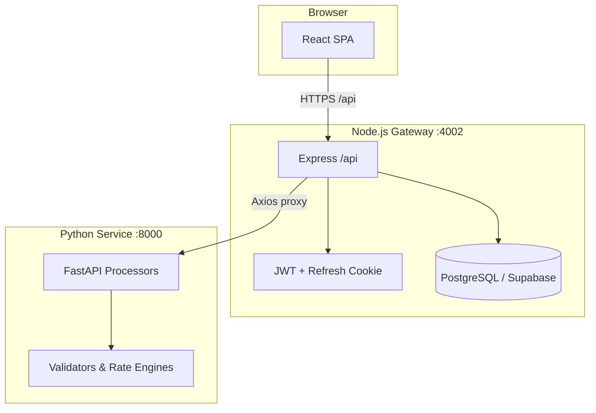
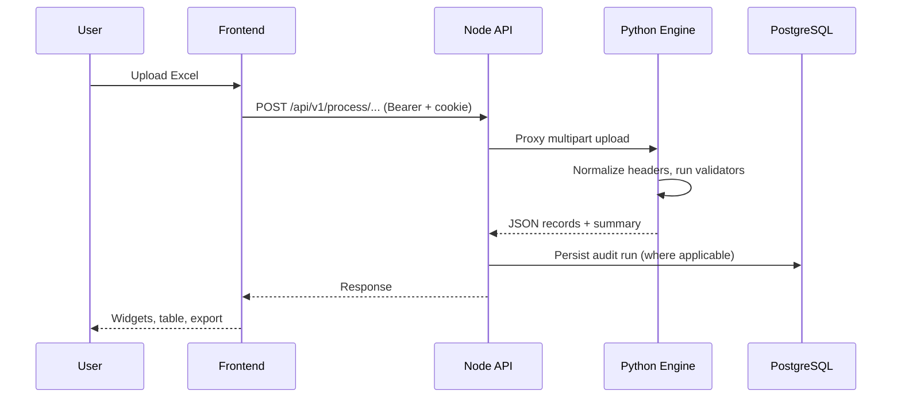

# HAA Audit Platform

Spreadsheet-driven audit workspace for jewellery and retail ledgers. Teams upload Excel workbooks; the platform validates structure and business rules and surfaces row-level issues with exports and dashboard analytics.

## Project Overview

| Layer | Role |
|-------|------|
| **Frontend** | React SPA — Scrutiny audits, dashboard, user management, settings |
| **Backend** | Node.js API gateway — auth, PostgreSQL persistence, proxies to Python |
| **Python service** | FastAPI audit engine — Excel parsing, validators, rate rules, exports |

Active audit modules: **PAN verification**, **Gross weight**, **Sales ledger (rate & ledger)**, **Sales return rate audit**, **Product average rates**, **Gold/silver rate book**, **Diamond/gem rate book**.

## Project Structure

```text
audit_platform/
├── frontend/
├── backend/
└── python-service/
```

### Frontend

```text
frontend/
├── public/
├── src/
│   ├── assets/
│   ├── components/
│   │   ├── audit/
│   │   ├── auth/
│   │   ├── cards/
│   │   ├── charts/
│   │   ├── layout/
│   │   ├── tables/
│   │   ├── ui/
│   │   └── upload/
│   ├── pages/
│   │   ├── CashLedgerPage.jsx
│   │   ├── NegativeBankPage.jsx
│   │   ├── PurchasePage.jsx
│   │   ├── SalesPage.jsx
│   │   ├── SalesReturnPage.jsx
│   │   └── TdsPage.jsx
│   ├── services/
│   │   ├── cashLedger.service.js
│   │   ├── negativeBank.service.js
│   │   ├── purchase.service.js
│   │   ├── sales.service.js
│   │   ├── salesReturn.service.js
│   │   ├── tds.service.js
│   │   └── apiClient.js
│   ├── hooks/
│   ├── context/
│   ├── routes/
│   ├── config/
│   ├── constants/
│   ├── styles/
│   ├── types/
│   ├── utils/
│   ├── App.jsx
│   ├── index.css
│   └── main.jsx
├── index.html
├── package.json
└── vite.config.js
```

### Backend

```text
backend/
├── prisma/
│   ├── migrations/
│   └── schema.prisma
├── src/
│   ├── config/
│   ├── constants/
│   ├── routes/
│   │   ├── cashLedger.routes.js
│   │   ├── negativeBank.routes.js
│   │   ├── purchase.routes.js
│   │   ├── sales.routes.js
│   │   ├── salesReturn.routes.js
│   │   ├── tds.routes.js
│   │   └── index.js
│   ├── controllers/
│   │   ├── cashLedger.controller.js
│   │   ├── negativeBank.controller.js
│   │   ├── purchase.controller.js
│   │   ├── sales.controller.js
│   │   ├── salesReturn.controller.js
│   │   └── tds.controller.js
│   ├── services/
│   │   ├── cashLedger.service.js
│   │   ├── negativeBank.service.js
│   │   ├── purchase.service.js
│   │   ├── sales.service.js
│   │   ├── salesReturn.service.js
│   │   └── tds.service.js
│   ├── repositories/
│   │   ├── cashLedger.repository.js
│   │   ├── negativeBank.repository.js
│   │   ├── purchase.repository.js
│   │   ├── sales.repository.js
│   │   ├── salesReturn.repository.js
│   │   └── tds.repository.js
│   ├── validators/
│   │   ├── cashLedger.validator.js
│   │   ├── negativeBank.validator.js
│   │   ├── purchase.validator.js
│   │   ├── sales.validator.js
│   │   ├── salesReturn.validator.js
│   │   └── tds.validator.js
│   ├── jobs/
│   ├── lib/
│   ├── middleware/
│   ├── openapi/
│   ├── types/
│   ├── utils/
│   ├── app.js
│   └── server.js
├── package.json
└── prisma.config.js
```

### Python service

```text
python-service/
└── app/
    ├── engines/
    │   ├── cash_ledger_engine/
    │   │   ├── config/
    │   │   ├── engine/
    │   │   ├── parsers/
    │   │   └── validators/
    │   ├── negative_bank_engine/
    │   │   ├── config/
    │   │   ├── engine/
    │   │   ├── parsers/
    │   │   └── validators/
    │   ├── purchase_engine/
    │   │   ├── config/
    │   │   ├── engine/
    │   │   ├── parsers/
    │   │   └── validators/
    │   ├── sales_engine/
    │   │   ├── config/
    │   │   ├── engine/
    │   │   ├── parsers/
    │   │   └── validators/
    │   ├── sales_return_engine/
    │   │   ├── config/
    │   │   ├── engine/
    │   │   ├── parsers/
    │   │   └── validators/
    │   └── tds_engine/
    │       ├── config/
    │       ├── engine/
    │       ├── parsers/
    │       └── validators/
    ├── core/
    ├── data/
    ├── routers/
    ├── schemas/
    ├── services/
    ├── utils/
    ├── validators/
    └── main.py
```
## Usage

```bash
# Python service (port 8000)
cd python-service
python -m venv .venv
source .venv/bin/activate          # Windows: .venv\Scripts\activate
pip install -r requirements.txt
uvicorn app.main:app --reload --host 127.0.0.1 --port 8000

# Backend (port 4002)
cd backend
npm install
npx prisma generate
npx prisma migrate deploy
npm run dev

# Frontend (port 4000)
cd frontend
npm install
npm run dev
```

Open http://127.0.0.1:4000

## Architecture



## Tech Stack

| Area | Technologies |
|------|----------------|
| Frontend | React 19, Vite, Tailwind CSS 4, React Router, TanStack Table, Axios |
| Backend | Node.js 18+, Express, Prisma, PostgreSQL, JWT, Multer, Helmet, Swagger |
| Python | FastAPI, Uvicorn, Pandas, Polars, DuckDB, OpenPyXL, Pydantic, Pytest |

## Modules

| Module | Route | Description |
|--------|-------|-------------|
| Dashboard | `/dashboard` | KPIs, audit trend, issues by category, recent uploads |
| PAN verification | `/scrutiny/pan` | PAN format, ₹2L PAN rule, ₹50k address proof |
| Gross weight | `/scrutiny/gross-weight` | Manual vs auto gross weight tolerance |
| Sales ledger | `/scrutiny/sales-ledger` | Account/product mapping, UOM, rate deviation |
| Sales return | `/scrutiny/sales-return-rate` | Return file validation + rate vs sales averages |
| Product averages | `/sales-audit/product-average-rates` | Stored averages from last sales audit |
| Rate rule book | `/scrutiny/rate-rule-book` | Gold & silver min/max rates |
| Diamond/gem rates | `/scrutiny/diamond-gem-rates` | Diamond product rate bands |
| Users | `/users` | User administration (role-based) |

## Deployment Instructions

1. **PostgreSQL** — provision database; set `DATABASE_URL` and `DIRECT_URL` in `backend/.env`.
2. **Backend** — set `NODE_ENV=production`, strong JWT secrets, explicit `CORS_ORIGIN`. Run `npx prisma migrate deploy` and `npm start`.
3. **Python** — run behind private network only (`APP_ENV=production`). Use Uvicorn/gunicorn with process manager.
4. **Frontend** — build with `VITE_API_BASE_URL` pointing to the public API URL; serve `dist/` via CDN or reverse proxy.
5. **Reverse proxy** — terminate TLS; route `/api` to Node; never expose Python port 8000 publicly.

## Environment Variables

### Frontend (`frontend/.env`)

| Variable | Purpose |
|----------|---------|
| `VITE_API_BASE_URL` | Node gateway URL (empty in dev — uses Vite proxy) |
| `VITE_API_URL` | Optional direct Python URL (legacy; rate book uses Node) |

### Backend (`backend/.env`)

| Variable | Purpose |
|----------|---------|
| `PORT` | HTTP listen port (default 4002) |
| `NODE_ENV` | `development` or `production` |
| `DATABASE_URL` | PostgreSQL connection (pooler) |
| `DIRECT_URL` | Direct PostgreSQL URL for migrations |
| `JWT_SECRET` | Access token signing secret |
| `REFRESH_TOKEN_SECRET` | Refresh token signing secret |
| `JWT_EXPIRES_IN` | Access token TTL (default `15m`) |
| `REFRESH_TOKEN_EXPIRES_IN` | Refresh token TTL (default `7d`) |
| `PYTHON_SERVICE_URL` | FastAPI base URL |
| `CORS_ORIGIN` | Allowed origins (`*` dev only; required in production) |
| `ENABLE_SWAGGER` | Swagger UI (auto-disabled when `NODE_ENV=production`) |

### Python (`python-service/.env`)

| Variable | Purpose |
|----------|---------|
| `APP_ENV` | `development` or `production` |
| `LOG_LEVEL` | Logging level (default `INFO`) |
| `AUDIT_DEBUG_EXPORT` | Write debug workbooks when `true` |
| `SALES_DEBUG_EXPORT` | Write sales debug exports when `true` |

See [backend/README.md](backend/README.md) and [python-service/README.md](python-service/README.md) for detail.

## User Roles

Roles are stored in PostgreSQL (`roles` table) and linked to users via `role_id`. Typical roles include administrators and auditors. Protected routes require a valid JWT access token; admin features (user management) enforce role checks on the backend.

## Audit Flow



1. User authenticates (login → access token + HttpOnly refresh cookie).
2. User uploads workbook on a Scrutiny page.
3. Node validates upload limits and forwards to Python.
4. Python detects header row, normalizes columns, runs processor-specific rules.
5. Response includes `totalRows`, `errorRows`, `summary`, and `records` / `exceptionRecords`.
6. User filters issues, exports invalid rows (Excel/CSV/PDF).
7. Dashboard aggregates historical runs from PostgreSQL.

## Production Checklist

- [ ] `NODE_ENV=production` on backend
- [ ] Strong `JWT_SECRET` and `REFRESH_TOKEN_SECRET` (32+ characters)
- [ ] `CORS_ORIGIN` set to frontend origin (not `*`)
- [ ] `npx prisma migrate deploy` completed
- [ ] Python service on private network only
- [ ] `VITE_API_BASE_URL` set at frontend build time
- [ ] HTTPS via reverse proxy
- [ ] Smoke test: login, each audit type, dashboard, logout
- [ ] Confirm API 500 responses do not leak stack traces

## Documentation

| Document | Purpose |
|----------|---------|
| [backend/README.md](backend/README.md) | Node API, auth, Prisma, routes |
| [python-service/README.md](python-service/README.md) | Audit engines, validators, processors |
