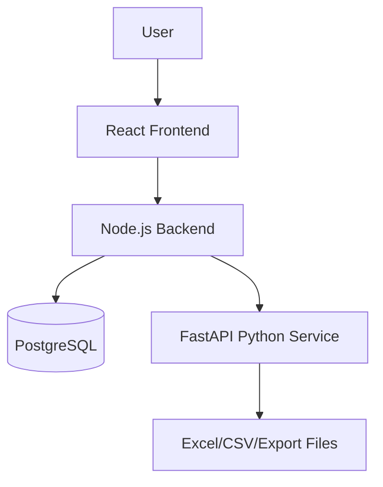
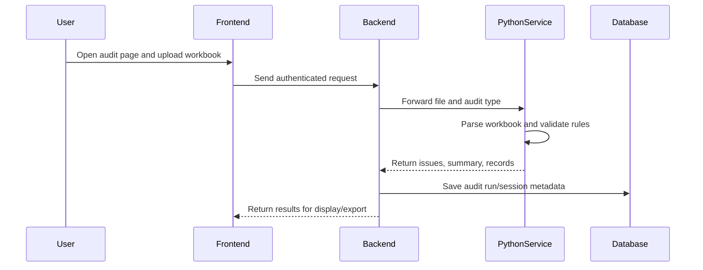
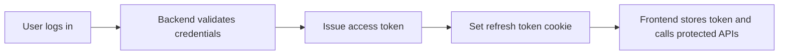
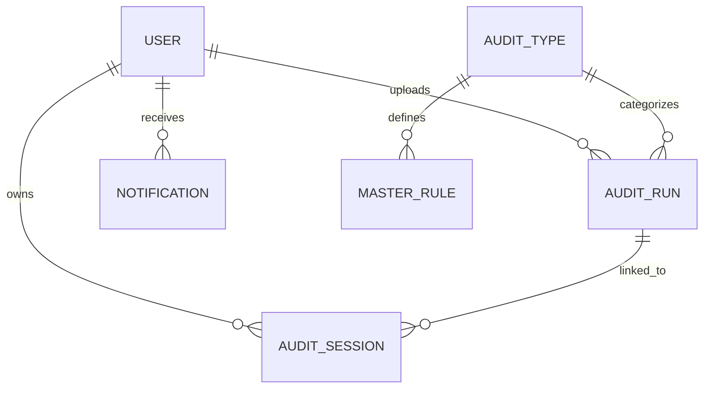
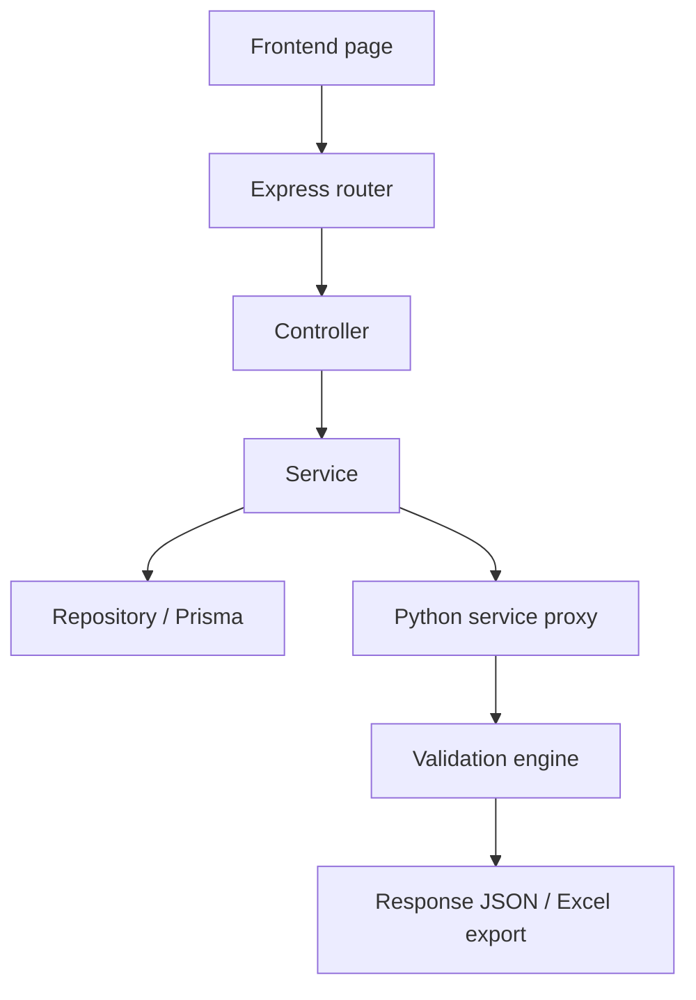

# HAA Audit Platform

The HAA Audit Platform is a full-stack audit workflow system for jewellery and retail operations. It allows users to upload Excel workbooks, validate them against business rules, review exceptions, export reports, and monitor audit activity through a dashboard.

This repository contains three main layers:

- Frontend: a React-based web application for audit screens, dashboards, and user flows
- Backend: a Node.js/Express API gateway for authentication, persistence, routing, and orchestration
- Python service: a FastAPI processing engine for spreadsheet validation, rule execution, exports, and analytics

## Table of Contents

1. [Project Overview](#1-project-overview)
2. [System Architecture](#2-system-architecture)
3. [Repository Structure](#3-repository-structure)
4. [Module-by-Module Explanation](#4-module-by-module-explanation)
5. [Authentication and Authorization](#5-authentication-and-authorization)
6. [Database Structure](#6-database-structure)
7. [API Architecture and Request Flow](#7-api-architecture-and-request-flow)
8. [Controller → Service → Repository Flow](#8-controller--service--repository-flow)
9. [Shared Utilities and Configuration](#9-shared-utilities-and-configuration)
10. [Validation, Error Handling, Logging, and Auditing](#10-validation-error-handling-logging-and-auditing)
11. [File Upload and Processing Flow](#11-file-upload-and-processing-flow)
12. [Background Processing and Jobs](#12-background-processing-and-jobs)
13. [Third-Party Integrations](#13-third-party-integrations)
14. [Installation and Run Guide](#14-installation-and-run-guide)
15. [Development Workflow](#15-development-workflow)
16. [Coding Standards and Best Practices](#16-coding-standards-and-best-practices)
17. [API Documentation Overview](#17-api-documentation-overview)
18. [Deployment](#18-deployment)
19. [Troubleshooting](#19-troubleshooting)
20. [FAQ](#20-faq)

---

## 1. Project Overview

The platform is designed to support audit operations for financial and inventory-related spreadsheets. A user uploads a workbook, the system validates the content, identifies problems, and returns a structured result for review and export.

### What the platform does

- Uploads Excel files for audit processing
- Validates rows, headers, formulas, and business rules
- Detects issues such as invalid PANs, gross weight mismatches, rate deviation, mapping errors, and TDS-related anomalies
- Stores audit runs and session state for later review
- Shows dashboard metrics and recent activity
- Supports role-based access for admin, auditor, and viewer users

### Core business areas

- PAN verification
- Gross weight verification
- Sales ledger audit
- Sales return rate audit
- Purchase-related audits
- Cash ledger audit
- Negative bank audit
- TDS and party-wise summaries
- Rate rule and diamond/gem rate maintenance
- Product average rate tracking

---

## 2. System Architecture

The system is split into three cooperating layers:



### Request lifecycle



### Architecture summary

- The frontend is a single-page app built with React and Vite.
- The backend is an Express API gateway that performs authentication, validation, persistence, and proxying.
- The Python service performs heavy computation and workbook inspection without exposing business logic directly to the browser.

---

## 3. Repository Structure

### Root structure

```text
audit_platform/
├── backend/
├── frontend/
├── python-service/
├── README.md
├── SETUP.md
└── documentation-cleanup-report.md
```

### Backend structure

```text
backend/
├── prisma/
│   ├── migrations/
│   └── schema.prisma
├── src/
│   ├── app.js
│   ├── server.js
│   ├── config/
│   ├── constants/
│   ├── controllers/
│   ├── jobs/
│   ├── lib/
│   ├── middleware/
│   ├── openapi/
│   ├── repositories/
│   ├── routes/
│   ├── services/
│   ├── types/
│   ├── utils/
│   ├── validators/
│   └── openapi/
├── package.json
└── prisma.config.js
```

### Frontend structure

```text
frontend/
├── public/
├── src/
│   ├── App.jsx
│   ├── main.jsx
│   ├── index.css
│   ├── assets/
│   ├── components/
│   ├── config/
│   ├── constants/
│   ├── context/
│   ├── hooks/
│   ├── pages/
│   ├── routes/
│   ├── services/
│   ├── styles/
│   ├── types/
│   └── utils/
├── index.html
├── package.json
├── vite.config.js
└── vercel.json
```

### Python service structure

```text
python-service/
├── app/
│   ├── config/
│   ├── core/
│   ├── data/
│   ├── engines/
│   ├── main.py
│   ├── routers/
│   ├── sales_engine/
│   ├── sales_return_engine/
│   ├── schemas/
│   ├── services/
│   ├── tds_engine/
│   ├── utils/
│   ├── validators/
│   └── __init__.py
├── debug/
├── scripts/
├── tests/
├── requirements.txt
└── pytest.ini
```

### Purpose of the main folders

- backend/src/app.js: Express application bootstrap, middleware, health routes, and API mount points
- backend/src/server.js: server startup, port binding, and graceful shutdown handling
- backend/src/config: environment config and validation logic
- backend/src/controllers: HTTP handlers for each route group
- backend/src/services: business logic and integration with the Python engine
- backend/src/repositories: Prisma-based database access layer
- backend/src/routes: route registration for all endpoints
- backend/src/middleware: authentication, error handling, upload middleware, request IDs
- backend/src/validators: request payload validation
- backend/src/utils: shared helpers such as cookies, tokens, logging, and response builders
- backend/prisma/schema.prisma: database schema and relationships
- frontend/src/pages: each audit module page in the UI
- frontend/src/services: frontend API clients for each module
- frontend/src/components: reusable UI, charts, cards, forms, layout, and auth blocks
- python-service/app/routers: FastAPI endpoints for processing and rule-book services
- python-service/app/services: workbook processing orchestration and audit engine entry points
- python-service/app/engines and sales_engine: rule execution, parsing, normalization, and validation pipelines

---

## 4. Module-by-Module Explanation

### Dashboard

Purpose:
- Show KPIs, recent audits, issue counts, and trends.

Main entry points:
- Frontend page: [frontend/src/pages/Dashboard.jsx](frontend/src/pages/Dashboard.jsx)
- Backend route: /api/v1/dashboard
- Backend controller/service: [backend/src/controllers/dashboard.controller.js](backend/src/controllers/dashboard.controller.js) and [backend/src/services/dashboard.service.js](backend/src/services/dashboard.service.js)

### PAN Verification

Purpose:
- Validate PAN fields, check threshold-based business rules, and surface invalid rows.

Relevant files:
- Frontend: [frontend/src/pages/PanVerification.jsx](frontend/src/pages/PanVerification.jsx)
- Backend: [backend/src/controllers/pan.controller.js](backend/src/controllers/pan.controller.js)
- Python: [python-service/app/routers/pan_router.py](python-service/app/routers/pan_router.py)

Rules covered:
- PAN format validation
- High-value PAN requirement
- Address proof requirement

### Gross Weight Audit

Purpose:
- Compare manual and auto gross weights and identify mismatches.

Relevant files:
- Frontend: [frontend/src/pages/GrossWeight.jsx](frontend/src/pages/GrossWeight.jsx)
- Backend: [backend/src/controllers/grossWeight.controller.js](backend/src/controllers/grossWeight.controller.js)
- Python: [python-service/app/routers/gross_weight_router.py](python-service/app/routers/gross_weight_router.py)

### Sales Ledger Audit

Purpose:
- Validate sales transactions, account/product mapping, unit of measure, unit rate deviation, and other ledger-level checks.

Relevant files:
- Frontend: [frontend/src/pages/SalesPage.jsx](frontend/src/pages/SalesPage.jsx)
- Backend: [backend/src/controllers/sales.controller.js](backend/src/controllers/sales.controller.js)
- Python: [python-service/app/routers/sales_router.py](python-service/app/routers/sales_router.py)

### Sales Return Audit

Purpose:
- Process return files, validate rows, compare return rates against stored averages, and report exceptions.

Relevant files:
- Frontend: [frontend/src/pages/SalesReturnPage.jsx](frontend/src/pages/SalesReturnPage.jsx)
- Backend: [backend/src/controllers/salesReturn.controller.js](backend/src/controllers/salesReturn.controller.js)
- Python: [python-service/app/routers/sales_return_router.py](python-service/app/routers/sales_return_router.py)

### Purchase-Related Modules

The platform also includes purchase-focused audit screens:

- Purchase rate ledger: [frontend/src/pages/PurchasePage.jsx](frontend/src/pages/PurchasePage.jsx)
- Purchase return audit: [frontend/src/pages/PurchaseReturnPage.jsx](frontend/src/pages/PurchaseReturnPage.jsx)
- Purchase gross weight: [frontend/src/pages/PurchaseGrossWeight.jsx](frontend/src/pages/PurchaseGrossWeight.jsx)

These modules follow the same upload → validate → review → export pattern used elsewhere.

### Cash Ledger Audit

Purpose:
- Validate cash ledger structures, detect mismatches, and support ledger review workflows.

Relevant files:
- Frontend: [frontend/src/pages/CashLedgerPage.jsx](frontend/src/pages/CashLedgerPage.jsx)
- Backend: [backend/src/controllers/cashLedger.controller.js](backend/src/controllers/cashLedger.controller.js)
- Python: [python-service/app/routers/cash_ledger_router.py](python-service/app/routers/cash_ledger_router.py)

### Negative Bank Audit

Purpose:
- Review negative bank entries and other account anomalies.

Relevant files:
- Frontend: [frontend/src/pages/NegativeBankPage.jsx](frontend/src/pages/NegativeBankPage.jsx)
- Backend: [backend/src/controllers/negativeBank.controller.js](backend/src/controllers/negativeBank.controller.js)
- Python: [python-service/app/routers/negative_bank_router.py](python-service/app/routers/negative_bank_router.py)

### Rate Rule Book

Purpose:
- Maintain gold/silver rate bands and related validation rules.

Relevant files:
- Frontend: [frontend/src/pages/RateRuleBook.jsx](frontend/src/pages/RateRuleBook.jsx)
- Backend: [backend/src/controllers/rateRules.controller.js](backend/src/controllers/rateRules.controller.js)
- Python: [python-service/app/routers/rate_rules_router.py](python-service/app/routers/rate_rules_router.py)

### Diamond and Gem Rate Book

Purpose:
- Manage diamond/gem product rate bands and supported rate rules.

Relevant files:
- Frontend: [frontend/src/pages/DiamondGemRateBook.jsx](frontend/src/pages/DiamondGemRateBook.jsx)
- Backend: [backend/src/controllers/diamondRateRules.controller.js](backend/src/controllers/diamondRateRules.controller.js)
- Python: [python-service/app/routers/diamond_rate_rules_router.py](python-service/app/routers/diamond_rate_rules_router.py)

### TDS Modules

The platform contains TDS-related features for rule-book management and reporting:

- TDS rule book: [frontend/src/pages/TdsPage.jsx](frontend/src/pages/TdsPage.jsx)
- Party-wise TDS summary: [frontend/src/pages/PartyWiseTdsSummaryPage.jsx](frontend/src/pages/PartyWiseTdsSummaryPage.jsx)
- TDS Rate 0.1: [frontend/src/pages/TdsRate01Page.jsx](frontend/src/pages/TdsRate01Page.jsx)

Relevant backend and Python routers:
- [backend/src/controllers/tds.controller.js](backend/src/controllers/tds.controller.js)
- [backend/src/controllers/partyWiseTds.controller.js](backend/src/controllers/partyWiseTds.controller.js)
- [backend/src/controllers/tds01.controller.js](backend/src/controllers/tds01.controller.js)

### Product Average Rates

Purpose:
- Store and display average rates calculated from sales audits so later comparisons can use historical baselines.

Relevant files:
- Frontend: [frontend/src/pages/ProductAverageRates.jsx](frontend/src/pages/ProductAverageRates.jsx)
- Backend: [backend/src/controllers/sales.controller.js](backend/src/controllers/sales.controller.js)

### User Management and Profiles

Purpose:
- Manage users, roles, profile details, and password reset flows.

Relevant files:
- Frontend: [frontend/src/pages/Users.jsx](frontend/src/pages/Users.jsx) and [frontend/src/pages/Profile.jsx](frontend/src/pages/Profile.jsx)
- Backend: [backend/src/controllers/user.controller.js](backend/src/controllers/user.controller.js)

### Notifications and Audit Session State

Purpose:
- Track user alerts and preserve audit session state between screens or refreshes.

Relevant files:
- Backend: [backend/src/controllers/notification.controller.js](backend/src/controllers/notification.controller.js) and [backend/src/controllers/auditSession.controller.js](backend/src/controllers/auditSession.controller.js)

---

## 5. Authentication and Authorization

The application uses JWT-based authentication with refresh token cookies.

### Authentication flow



### How it works

1. The user signs in through the frontend.
2. The backend verifies credentials and issues an access token.
3. The frontend includes the access token in the Authorization header.
4. The backend checks the token using middleware before allowing access to protected routes.
5. Refresh tokens are stored server-side and rotated when needed.

### Relevant files

- [backend/src/routes/auth.routes.js](backend/src/routes/auth.routes.js)
- [backend/src/services/auth.service.js](backend/src/services/auth.service.js)
- [backend/src/services/refreshTokenStore.js](backend/src/services/refreshTokenStore.js)
- [backend/src/middleware/auth.middleware.js](backend/src/middleware/auth.middleware.js)

### Role model

The Prisma schema defines three roles:

- ADMIN
- AUDITOR
- VIEWER

Admin features such as user management are protected by backend checks.

---

## 6. Database Structure

The backend uses PostgreSQL with Prisma ORM.

### Core entities

- User
- AuthToken
- AuditType
- MasterRule
- AuditRun
- DashboardSnapshot
- AuditSession
- Notification

### Relationship overview



### Important Prisma concepts

- Users are linked to audit runs and notifications.
- Audit runs belong to an audit type and an uploader.
- Audit sessions store UI state and can be resumed later.
- Master rules allow configurable validation thresholds and business rules.

### Primary schema file

- [backend/prisma/schema.prisma](backend/prisma/schema.prisma)

---

## 7. API Architecture and Request Flow

The backend exposes a versioned API under /api/v1 and legacy compatibility routes under /api.

### Main API groups

- /api/auth: login, refresh, logout, password reset
- /api/v1/process/*: audit processing endpoints for PAN, sales, sales return, purchase, cash ledger, negative bank, and TDS
- /api/v1/rate-rules: rate book rules
- /api/v1/diamond-rate-rules: diamond/gem rate rules
- /api/v1/dashboard: dashboard metrics
- /api/v1/users: user management
- /api/v1/notifications: notifications
- /api/v1/audit-sessions: audit session save/restore

### Request flow diagram



---

## 8. Controller → Service → Repository Flow

A standard request in this codebase follows this pattern:

1. Route receives the request.
2. Controller validates the shape and forwards the request to a service.
3. Service handles business logic and calls downstream components.
4. Repository layer talks to PostgreSQL through Prisma.
5. For audits, the backend forwards the uploaded workbook to Python for processing.

### Typical pattern

```js
// route -> controller -> service -> repository
app.post('/api/v1/process/sales', salesController.processSales);
```

### Why this matters

- Controllers stay thin and focused on HTTP concerns.
- Services contain feature logic.
- Repositories keep database access centralized.
- The Python service handles heavy file-processing tasks without muddling the Node layer.

---

## 9. Shared Utilities and Configuration

### Backend shared utilities

- [backend/src/utils](backend/src/utils): token helpers, cookie helpers, logging, response utilities
- [backend/src/middleware](backend/src/middleware): auth, upload, UUID/request ID, error middleware
- [backend/src/config](backend/src/config): environment loading and validation
- [backend/src/constants](backend/src/constants): shared constants and status values
- [backend/src/validators](backend/src/validators): input validation logic

### Frontend shared utilities

- [frontend/src/context](frontend/src/context): app-level context providers
- [frontend/src/hooks](frontend/src/hooks): reusable hooks for data access and UI state
- [frontend/src/services](frontend/src/services): API wrappers for backend endpoints
- [frontend/src/utils](frontend/src/utils): helper utilities
- [frontend/src/constants](frontend/src/constants): shared UI and route constants

### Python shared utilities

- [python-service/app/utils](python-service/app/utils): Excel readers, exporters, response builders, generic helpers
- [python-service/app/validators](python-service/app/validators): shared validators and format checks
- [python-service/app/schemas](python-service/app/schemas): response and request schemas

### Environment configuration

- Backend env file: [backend/README.md](backend/README.md)
- Python env file: [python-service/README.md](python-service/README.md)
- Frontend env file: usually VITE_API_BASE_URL for the API gateway

---

## 10. Validation, Error Handling, Logging, and Auditing

### Validation

Validation happens at multiple layers:

- Frontend form and page-level validation
- Backend request validation
- Python processor validation for workbook headers and business rules

### Error handling

- Backend uses centralized error middleware.
- Python returns structured JSON responses and catches sheet validation issues.
- Invalid requests return useful error messages instead of crashing silently.

### Logging

- Node backend uses request logging in development and combined logging in production.
- Python service logs processing errors and route-level failures.

### Auditing

Every major process creates or updates audit metadata:

- Audit runs are recorded for each file upload
- Sessions can be saved and resumed
- Dashboards consume audit snapshots and summaries

---

## 11. File Upload and Processing Flow

### Upload flow

1. A user selects a workbook on a module page.
2. The frontend sends the file to the backend.
3. The backend validates the incoming request and forwards the file to the Python service.
4. The Python service reads the workbook, detects headers, normalizes columns, and validates rows.
5. Results are returned to the frontend for display and export.

### Storage behavior

- The system stores metadata such as filename, size, hash, upload time, and processing status in PostgreSQL.
- File paths and status are persisted as audit run records.
- Export files are generated through the Python layer and delivered to the client.

---

## 12. Background Processing and Jobs

This project does not rely on a heavy queue system in the current setup. Instead, it uses:

- synchronous processing on request
- background-friendly service execution for audit runs
- persistence of results and status in the database

Relevant folder:
- [backend/src/jobs](backend/src/jobs)

The platform is designed so that processing status can be tracked and resumed through audit sessions and audit runs.

---

## 13. Third-Party Integrations

The platform integrates with the following technologies:

- PostgreSQL via Prisma ORM
- Express and Node.js for API hosting
- FastAPI and Uvicorn for Python-based processing
- JWT and cookie-based authentication
- Multer for file uploads
- Swagger UI for API docs
- XLSX and Excel processing libraries for workbook reading/exporting
- React Router and TanStack Table for UI navigation and tabular data
- ApexCharts for dashboard visuals
- Nodemailer for email-based flows

---

## 14. Installation and Run Guide

### Prerequisites

- Node.js 18+
- npm
- Python 3.9+
- PostgreSQL
- Git

### 1. Clone the repository

```bash
git clone <repository-url>
cd audit_platform
```

### 2. Backend setup

```bash
cd backend
npm install
npx prisma generate
npx prisma migrate deploy
npm run dev
```

Backend runs on http://localhost:4002.

### 3. Frontend setup

```bash
cd frontend
npm install
npm run dev
```

Frontend runs on http://localhost:5173.

### 4. Python service setup

```bash
cd python-service
python -m venv .venv
source .venv/bin/activate
pip install -r requirements.txt
uvicorn app.main:app --reload --host 127.0.0.1 --port 8000
```

Python service runs on http://127.0.0.1:8000.

### Example environment variables

Backend:

```env
PORT=4002
NODE_ENV=development
DATABASE_URL=postgresql://...
DIRECT_URL=postgresql://...
JWT_SECRET=your-secret
REFRESH_TOKEN_SECRET=your-secret
PYTHON_SERVICE_URL=http://127.0.0.1:8000
CORS_ORIGIN=http://localhost:5173
ENABLE_SWAGGER=true
```

Python:

```env
APP_ENV=development
LOG_LEVEL=INFO
AUDIT_DEBUG_EXPORT=false
SALES_DEBUG_EXPORT=false
```

---

## 15. Development Workflow

A recommended day-to-day workflow:

1. Start the database and required services.
2. Run the backend and frontend locally.
3. Use the relevant audit page for testing.
4. Upload sample Excel files and verify results.
5. Review dashboard and audit session state.
6. Commit changes and update related docs if business rules or routes change.

### Useful commands

```bash
cd backend && npm run dev
cd frontend && npm run dev
cd python-service && uvicorn app.main:app --reload --host 127.0.0.1 --port 8000
```

---

## 16. Coding Standards and Best Practices

- Keep controllers thin and focused on HTTP concerns.
- Put business logic in services.
- Keep database access inside repositories or Prisma service layers.
- Avoid mixing frontend UI logic with backend business rules.
- Use descriptive names for routes, controllers, and services.
- Add validation for every incoming request.
- Make error messages clear and user-friendly.
- Keep environment-specific values in env files.
- Prefer modular and reusable UI components over inline duplication.

---

## 17. API Documentation Overview

The backend exposes Swagger documentation when enabled.

- Swagger UI: http://localhost:4002/api-docs
- OpenAPI JSON: http://localhost:4002/openapi.json

The Python service also exposes FastAPI docs:

- Swagger UI: http://127.0.0.1:8000/docs
- Redoc: http://127.0.0.1:8000/redoc

For more detailed backend and Python API notes, see [backend/README.md](backend/README.md) and [python-service/README.md](python-service/README.md).

---

## 18. Deployment

### Backend deployment

1. Set production environment values.
2. Ensure PostgreSQL is reachable.
3. Run Prisma migrations.
4. Start the Node service behind a reverse proxy.
5. Protect the Python service behind the internal network.

### Frontend deployment

1. Build the frontend with the production API base URL.
2. Deploy the generated static assets.
3. Ensure the deployed API URL is reachable from the browser.

### Production checklist

- Use strong JWT secrets
- Set CORS correctly
- Disable public access to the Python service where possible
- Enable HTTPS through a proxy or CDN
- Verify health checks and login flow after deployment

---

## 19. Troubleshooting

### Common issues

- Backend cannot connect to PostgreSQL
  - Check DATABASE_URL and DIRECT_URL
  - Ensure the pooler URL uses the correct connection parameters

- Frontend cannot reach the backend
  - Verify VITE_API_BASE_URL and backend CORS settings

- Python service fails to process Excel files
  - Confirm the file extension and headers are supported
  - Check the logs for missing columns or validation issues

- Authentication errors
  - Confirm JWT secrets are set correctly
  - Clear stale browser tokens and refresh cookies if needed

- Port conflicts
  - Change the port or stop the process using the current port

---

## 20. FAQ

### What is the main purpose of this project?

It is an audit platform for validating financial and inventory spreadsheet data, surfacing issues, and presenting audit results in a web dashboard.

### Which technology handles the heavy validation work?

The Python FastAPI service performs the workbook parsing and rule validation.

### Is the frontend connected directly to Python?

No. The React frontend talks to the Node backend, and the backend proxies requests to the Python service.

### Can I add a new audit module?

Yes. The architecture supports adding new routes, controllers, services, and Python processors while reusing the shared request and response patterns.

### Where should I look first when onboarding?

Start with this README, then review [backend/README.md](backend/README.md), [python-service/README.md](python-service/README.md), and the route/controller/service files for the module you are working on.

---

This README is intended to be the single source of truth for understanding the project. For deeper implementation details, use the linked backend and Python service documentation alongside the code in the respective folders.

  U->>FE: Upload Excel
  FE->>API: POST /api/v1/process/... (Bearer + cookie)
  API->>PY: Proxy multipart upload
  PY->>PY: Normalize headers, run validators
  PY-->>API: JSON records + summary
  API->>DB: Persist audit run (where applicable)
  API-->>FE: Response
  FE-->>U: Widgets, table, export
```

1. User authenticates (login → access token + HttpOnly refresh cookie).
2. User uploads workbook on a Scrutiny page.
3. Node validates upload limits and forwards to Python.
4. Python detects header row, normalizes columns, runs processor-specific rules.
5. Response includes `totalRows`, `errorRows`, `summary`, and `records` / `exceptionRecords`.
6. User filters issues, exports invalid rows (Excel/CSV/PDF).
7. Dashboard aggregates historical runs from PostgreSQL.

## Production Checklist

- [ ] `NODE_ENV=production` on backend
- [ ] Strong `JWT_SECRET` and `REFRESH_TOKEN_SECRET` (32+ characters)
- [ ] `CORS_ORIGIN` set to frontend origin (not `*`)
- [ ] `npx prisma migrate deploy` completed
- [ ] Python service on private network only
- [ ] `VITE_API_BASE_URL` set at frontend build time
- [ ] HTTPS via reverse proxy
- [ ] Smoke test: login, each audit type, dashboard, logout
- [ ] Confirm API 500 responses do not leak stack traces

## Documentation

| Document | Purpose |
|----------|---------|
| [backend/README.md](backend/README.md) | Node API, auth, Prisma, routes |
| [python-service/README.md](python-service/README.md) | Audit engines, validators, processors |
