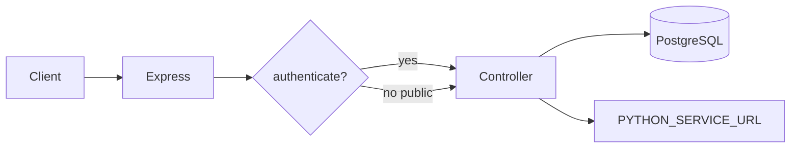

# Audit Platform — Node.js Backend

Express API gateway: authentication, PostgreSQL persistence, dashboard APIs, and proxy to the Python audit engine.

## Folder Structure

```text
backend/
  prisma/
    schema.prisma          # PostgreSQL models (users, roles, audit runs, sessions, notifications)
    migrations/            # Prisma migration history
  src/
    server.js              # Startup, config validation, graceful shutdown
    app.js                 # Middleware, routes, Swagger, health
    config/
      index.js             # PORT, CORS, JWT, Python URL, Swagger flag
      env-validation.js    # Required env vars; production secret checks
    routes/                # Express routers (see Routes below)
    controllers/           # Request handlers
    services/              # Business logic, Python client, auth, dashboard
    middleware/            # Auth, upload (Multer), request ID, errors
    repositories/          # Prisma data access
    utils/                 # JWT, cookies, logger
    openapi/openapi.json   # OpenAPI 3 spec for Swagger UI
```

## API Architecture

- **Public:** `GET /api/health`, `POST /api/auth/login`, `POST /api/auth/refresh`, `POST /api/auth/logout`, password-reset routes.
- **Protected:** All audit, dashboard, user, notification, and session routes require `Authorization: Bearer <accessToken>`.
- **Proxy pattern:** Upload routes accept `multipart/form-data` (field `file`), forward bytes to Python via `pythonClient.service.js`, return JSON or file streams.
- **Dual mounts:** Many features exist under both `/api/v1/...` and legacy `/api/...` paths for compatibility.



## Authentication

| Token | Storage | Lifetime |
|-------|---------|----------|
| Access | Frontend memory (`sessionStorage` / `localStorage`) | `JWT_EXPIRES_IN` (default 15m) |
| Refresh | HttpOnly cookie `refreshToken`, path `/api/auth` | `REFRESH_TOKEN_EXPIRES_IN` (default 7d) |

**Endpoints**

| Method | Path | Description |
|--------|------|-------------|
| `POST` | `/api/auth/login` | Returns `accessToken`; sets refresh cookie |
| `POST` | `/api/auth/refresh` | New access token from cookie |
| `POST` | `/api/auth/logout` | Revokes refresh token, clears cookie |
| `GET` | `/api/auth/me` | Current user (Bearer required) |

Refresh tokens are tracked server-side (`refreshTokenStore.js`). Production multi-instance deployments should replace the in-memory store with Redis or database.

## Prisma & PostgreSQL

- ORM: **Prisma** with PostgreSQL (Supabase-compatible pooler + direct URL).
- **Migrations:** `npx prisma migrate deploy` (production) or `npx prisma migrate dev` (development).
- **Generate client:** `npx prisma generate` after schema changes.

Key models: `User`, `Role`, `AuditRun`, `AuditSession`, `Notification`, `SalesProductAverage`, `PasswordResetToken`.

## Swagger

- **UI:** `http://localhost:4002/api-docs` (when `ENABLE_SWAGGER=true` and not production)
- **Spec:** `/openapi.json`
- Automatically **disabled** when `NODE_ENV=production`.

## Routes

| Prefix | Module |
|--------|--------|
| `/api/v1/process/pan` | PAN validate + export invalid rows |
| `/api/v1/process/gross-weight` | Gross weight validate + export |
| `/api/v1/process/sales` | Sales ledger validate + export |
| `/api/v1/process/sales-return` | Sales return file validation |
| `/api/sales-return` | Sales return audit run + rate comparison |
| `/api/v1/rate-rules` | Gold/silver rate book |
| `/api/v1/diamond-rate-rules` | Diamond rate rules |
| `/api/v1/rate-book` | Diamond rate book CRUD |
| `/api/v1/dashboard` | Widgets, trend, issues, recent audits |
| `/api/v1/sales-audit` | Product average rates |
| `/api/v1/audit-sessions` | Restore/save/clear UI session state |
| `/api/v1/users` | User CRUD |
| `/api/v1/notifications` | In-app notifications |
| `/api/auth` | Login, refresh, logout, password reset |

## Environment Variables

Configure **`backend/.env`** only:

```env
PORT=4002
NODE_ENV=development
DATABASE_URL=
DIRECT_URL=
JWT_SECRET=
REFRESH_TOKEN_SECRET=
JWT_EXPIRES_IN=15m
REFRESH_TOKEN_EXPIRES_IN=7d
PYTHON_SERVICE_URL=http://127.0.0.1:8000
CORS_ORIGIN=*
ENABLE_SWAGGER=true
```

| Variable | Required | Notes |
|----------|----------|-------|
| `PORT` | Yes | Listen port |
| `NODE_ENV` | Yes | `production` enforces CORS + secret rules |
| `DATABASE_URL` | Yes | PostgreSQL pooler URL |
| `DIRECT_URL` | Yes | Direct URL for migrations |
| `JWT_SECRET` | Yes | 32+ chars in production |
| `REFRESH_TOKEN_SECRET` | Yes | 32+ chars in production |
| `JWT_EXPIRES_IN` | No | Default `15m` |
| `REFRESH_TOKEN_EXPIRES_IN` | No | Default `7d` |
| `PYTHON_SERVICE_URL` | Yes | FastAPI base (no trailing slash) |
| `CORS_ORIGIN` | Prod | Comma-separated origins; no `*` in production |
| `ENABLE_SWAGGER` | No | Ignored in production (always off) |

## Deployment Steps

1. Set production env vars in `backend/.env`.
2. `npm ci && npx prisma generate && npx prisma migrate deploy`
3. `NODE_ENV=production npm start` (or PM2/systemd)
4. Ensure `PYTHON_SERVICE_URL` reaches the Python service on a private network.
5. Place reverse proxy in front with TLS; forward `/api` to this service.
6. Verify `GET /api/health` returns `{ "status": "ok" }`.

## Local Development

```bash
cd backend
npm install
npx prisma generate
npm run dev
```

Start **python-service** first. Default port **4002** matches the frontend Vite dev proxy.
