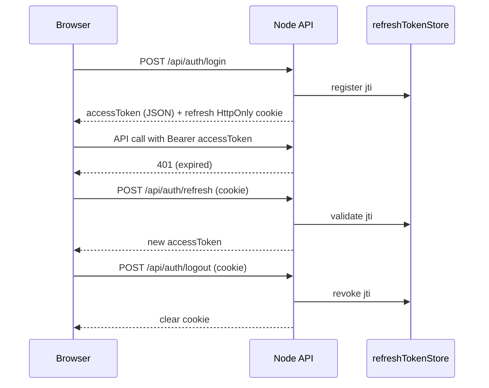

# Security Hardening Report

**Date:** 2026-06-19  
**Scope:** Authentication, security, and environment handling only — no audit logic, validations, or database schema changes.

---

## Summary

| Area | Status |
|------|--------|
| JWT access tokens (15m) | **Implemented** |
| Refresh tokens (7d, HttpOnly cookie) | **Implemented** |
| Separate `JWT_SECRET` / `REFRESH_TOKEN_SECRET` | **Implemented** |
| Startup env validation | **Implemented** |
| Production default-secret rejection | **Implemented** |
| Protected audit & admin routes | **Implemented** |
| Swagger auto-disabled in production | **Implemented** |
| CORS `*` rejected in production | **Implemented** (existing + enforced) |
| Frontend 401 → refresh → retry | **Implemented** |
| `.gitignore` secret protection | **Updated** |

---

## 1. JWT implementation

**Files:** `backend/src/utils/jwt.util.js`, `backend/src/config/index.js`

| Token | Secret | Lifetime | Storage |
|-------|--------|----------|---------|
| Access | `JWT_SECRET` | `JWT_EXPIRES_IN` (default **15m**) | Frontend memory (`sessionStorage` / `localStorage`) |
| Refresh | `REFRESH_TOKEN_SECRET` | `REFRESH_TOKEN_EXPIRES_IN` (default **7d**) | **HttpOnly** cookie (`refreshToken`, path `/api/auth`) |

- Algorithms restricted to **HS256**.
- Refresh payload includes `type: 'refresh'` and unique `jti` for server-side revocation.
- Default/placeholder secrets are **rejected in production** at startup.

---

## 2. Refresh token flow



**Endpoints:**

| Method | Path | Auth |
|--------|------|------|
| `POST` | `/api/auth/login` | Public |
| `POST` | `/api/auth/refresh` | Refresh cookie |
| `POST` | `/api/auth/logout` | Refresh cookie |
| `GET` | `/api/auth/me` | Bearer access token |

Legacy aliases remain at `/api/v1/auth/*` for password reset and backward compatibility.

**Server-side store:** `backend/src/services/refreshTokenStore.js` (in-memory `jti` registry with TTL cleanup).

---

## 3. Protected routes

All routes below require `authenticate` middleware (Bearer access token):

| Area | Route prefix |
|------|----------------|
| PAN audit | `/api/v1/process/pan/*` |
| Gross weight audit | `/api/v1/process/gross-weight/*` |
| Sales audit | `/api/v1/process/sales/*` |
| Sales return (process) | `/api/v1/process/sales-return/*` |
| Sales return audit | `/api/sales-return/*` |
| Rate rules (gold/silver) | `/api/v1/rate-rules/*` |
| Diamond rate rules | `/api/v1/diamond-rate-rules/*` |
| Rate book | `/api/v1/rate-book/*` |
| Dashboard | `/api/v1/dashboard/*`, `/api/dashboard/*` |
| Users | `/api/v1/users/*` |
| Notifications | `/api/v1/notifications/*`, `/api/notifications/*` |
| Audit sessions | `/api/v1/audit-sessions/*`, `/api/audit-sessions/*` |
| Sales audit API | `/api/v1/sales-audit/*`, `/api/sales-audit/*` |

**Public endpoints:**

- `GET /api/health`
- `POST /api/auth/login`
- `POST /api/auth/refresh`
- `POST /api/auth/logout`
- `POST /api/auth/forgot-password`
- `GET /api/auth/reset-password/validate`
- `POST /api/auth/reset-password`

---

## 4. Environment validation

**File:** `backend/src/config/env-validation.js`

**Required at startup (all environments):**

- `JWT_SECRET`
- `REFRESH_TOKEN_SECRET`
- `DATABASE_URL`
- `DIRECT_URL`

**Production-only checks:**

- Rejects `JWT_SECRET` if it equals `your-super-secret-jwt-key-change-this-in-production` or placeholder values (`replace_me`, etc.).
- Rejects `REFRESH_TOKEN_SECRET` if it equals `your-super-secret-refresh-token-key-change-this-in-production` or placeholders.
- Requires each secret to be **≥ 32 characters**.

**Template:** `backend/.env.example`

---

## 5. Swagger status

**File:** `backend/src/config/index.js`

- When `NODE_ENV=production`, `ENABLE_SWAGGER` is **forced to `false`** regardless of env flag.
- `/api-docs` and `/openapi.json` are not mounted in production.

---

## 6. CORS validation

**File:** `backend/src/config/index.js`

- `CORS_ORIGIN=*` is allowed in **development** only.
- In **production**, startup fails if `CORS_ORIGIN` is `*`, empty, or unset.
- `credentials: true` enabled for refresh cookie support.

---

## 7. Frontend changes

**Files:** `frontend/src/services/api.js`, `frontend/src/utils/authUser.js`, `frontend/src/pages/Login.jsx`, `frontend/src/services/authService.js`, `frontend/src/components/layout/Sidebar.jsx`

- Login uses `POST /api/auth/login` with `credentials: 'include'`.
- Only **accessToken** stored in browser storage; refresh token never exposed to JavaScript.
- Axios interceptor on **401**: calls `/api/auth/refresh`, retries original request, or redirects to `/login`.
- Logout calls `POST /api/auth/logout` then clears local session.

---

## 8. Git security

**File:** `.gitignore`

```
.env
.env.*
!.env.example
```

Ensures live secrets (JWT, database URLs, Supabase credentials) are not committed. Example templates remain tracked via `!.env.example`.

---

## 9. Verification

| Check | Result |
|-------|--------|
| Backend env validation | **PASS** |
| Frontend production build | **PASS** |
| `cookie-parser` dependency | **Added** |

---

## 10. Remaining risks (not in scope)

| Risk | Mitigation recommendation |
|------|---------------------------|
| In-memory refresh token store | Use Redis/DB for multi-instance production |
| Python service still unauthenticated internally | Keep port 8000 private; only Node gateway public |
| No login rate limiting | Add `express-rate-limit` on `/api/auth/login` |
| Access token in localStorage (remember me) | XSS could steal short-lived token; keep CSP strict |
| Global JSON body limit still 10mb in `app.js` | Align with `REQUEST_BODY_JSON_LIMIT` separately |
| No deep health checks | Add DB/Python readiness to `/api/health/ready` |
| SMTP optional | Configure for production password reset emails |

---

## 11. Production deployment checklist

Before go-live:

1. Set `NODE_ENV=production`
2. Generate strong `JWT_SECRET` and `REFRESH_TOKEN_SECRET` (64+ chars each)
3. Set `CORS_ORIGIN=https://your-frontend-domain.com` (not `*`)
4. Set `FRONTEND_URL` for password reset emails
5. Configure SMTP (optional but recommended)
6. Run `npx prisma migrate deploy`
7. Keep Python service on private network only
8. Serve frontend with `/api` reverse proxy and SPA fallback

---

*No audit processors, validation rules, or Prisma schema were modified in this hardening pass.*
